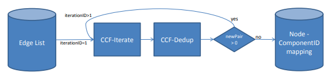
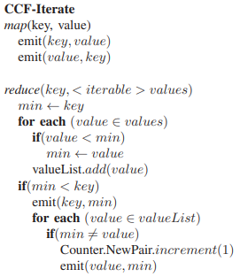
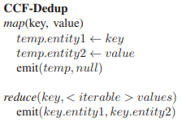

# Methode of Connected Component Finder (CCF) with MapReduce

## CCF Problem Explanation

The memory problem deals with the detection and counting of connected components in an undirected graph.
Let's start by defining the principle of connected components in graph theory.
For an undirected graph 𝑮 = (𝑽, 𝑬), with 𝑽 the set of nodes and 𝑬 the set of edges.
The graph is connected if whatever the nodes 𝒎 and 𝒏 of the set 𝑽, there is at least one chain connecting 𝒎 to 𝒏 from the edges present in 𝑬.
In an undirected graph, a connected component corresponds to a connected subgraph isolated from the other subgraphs, such that there is no chain connecting two nodes present in two distinct subgraphs.
The problems in graph theory lie in the detection of contabilization of connected components.
This problem does not have an optimal solution and there are many iterative algorithms to answer this complex problem.

## CCF Solution Algorithm

The solution is presented by Hakan Kardes, Siddharth Agrawal, Xin Wang, and Ang Sun in [CCF: Fast and Scalable Connected Component
Computation in MapReduce](https://www.cse.unr.edu/~hkardes/pdfs/ccf.pdf), and is based on the MapReduce pattern.

The resolution algorithm breaks down into two tasks:
* Iterate
* Dedup

Each task is composed of a first step implementing a Map subtask followed by a Reduce subtask.

### CCF Iterate

The operation of the Iterate sub-algorithm is as follows:

### CCF Dedup

The operation of the Dedup sub-algorithm is as follows:

## Implementation

The algorithm is implemented in PySpark (Python + Spark) and requires a Jupyter notebook to work.

The algorithm is designed to operate in a parallelized way on a cluster.

## Dataset

The dataset used is [web-Google](https://snap.stanford.edu/data/web-Google.html)

The data was released in 2002 by Google, the nodes represent web pages and directed edges represent hyperlinks between them.
The dataset is composed of 875,713 nodes and 5,105,039 edges.

## Results

The results are as follows for running the CCF algorithm: 
* Running time: 8 min 39 sec 
* Connected components found: 2,746

## Author

Created by **Timothé Le Chatelier** in **2021**